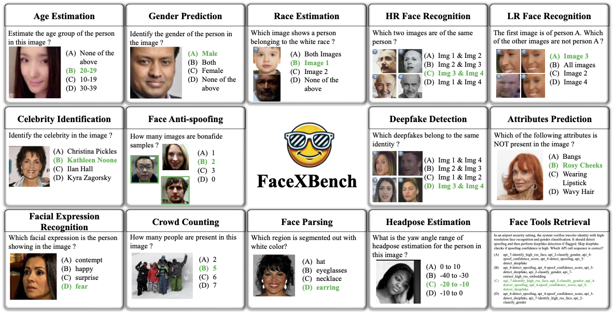
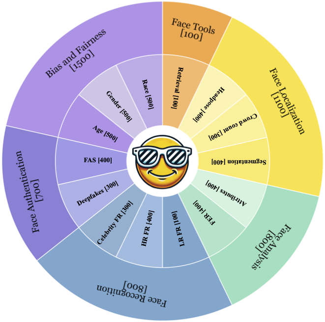
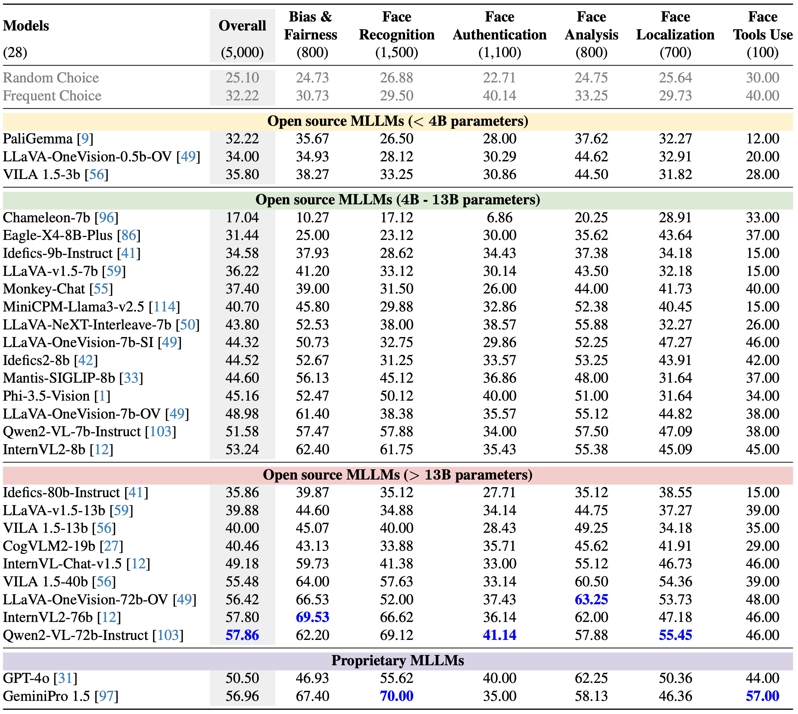

<div align="center">

  
# FaceXBench: Evaluating Multimodal LLMs <br> on Face Understanding


[Kartik Narayan](https://kartik-3004.github.io/portfolio/) &emsp; [Vibashan VS](https://vibashan.github.io) &emsp; [Vishal M. Patel](https://engineering.jhu.edu/faculty/vishal-patel/)

Johns Hopkins University

<a href='https://kartik-3004.github.io/facexbench/'></a>
<a href='[https://arxiv.org/abs/2412.08647](https://kartik-3004.github.io/facexbench/)'></a>

</div>
<hr />

## Contributions

<p align="center" width="100%">
  
</p>

FaceXBench examples cover a total of 14 tasks, addressing various aspects of face understanding. Each question may consist of single or multiple images. Every question includes four options, with only one correct answer. The options are strategically designed to prompt the model to analyze carefully before selecting an option.

The key contributions of our work are,<br>
1️⃣ <b>Introducing FaceXBench</b>: A comprehensive benchmark for evaluating MLLMs face understanding across 14 tasks in 6 key categories. It includes 5, 000 VQA questions derived from 25 public datasets and a newly developed dataset, FaceXAPI.<br>
2️⃣ <b>Extensive Evaluation</b>: We evaluate 26 open-source MLLMs and two proprietary models, GPT-4o and GeminiPro1.5, which achieve accuracies of 50.24% and 54.40%, respectively, highlighting the significant challenge posed by FaceXBench and the substantial room for improvement.<br>
3️⃣ <b>Analysis and Discussion</b>: We provide a detailed analysis of MLLMs performance across various aspects of face understanding, identifying areas where current MLLMs fall short. Additionally, we suggest potential research directions that could enhance MLLMs face understanding.<br>

> **<p align="justify"> Abstract:** *Multimodal Large Language Models (MLLMs) demonstrate impressive problem-solving abilities across a wide
> range of tasks and domains. However, their capacity for face understanding has not been systematically studied. To address this gap, we
> introduce FaceXBench, a comprehensive benchmark designed to evaluate MLLMs on complex face understanding tasks. FaceXBench includes 5,000
> multimodal multiple-choice questions derived from 25 public datasets and a newly created dataset, FaceXAPI. These questions cover 14 tasks
> across 6 broad categories, assessing MLLMs’ face understanding abilities in bias and fairness, face authentication, recognition, analysis,
> localization and tool retrieval. Using FaceXBench, we conduct an extensive evaluation of 26 open-source MLLMs alongside 2 proprietary models,
> revealing the unique challenges in complex face understanding tasks. We analyze the models across three evaluation settings: zero-shot,
> in-context task description, and chain-of-thought prompting. Our detailed analysis reveals that current MLLMs, including advanced models
> like GPT-4o, and GeminiPro 1.5, show significant room for improvement. We believe FaceXBench will be a crucial resource for developing MLLMs
> equipped to perform sophisticated face understanding.* </p>

## Statistics
<p align="center" width="100%">
  
</p>
Figure 2. Distribution of questions in FaceXBench across different categories and sub-categories.

## Results
<p align="center" width="100%">
  
</p>
Table 1. Results of different models on the FaceXBench. We categorize the open-source models in three categories based on parameter size: (a) Open source MLLMs (<4B parameters), (b) Open source MLLMs (4B-13B parameters), (c) Open source MLLMs (>13B parameters). Additionally, we evaluate (d) proprietary models. The best model in each category is highlighted in <b>bold</b>.


## :rocket: News
- [01/16/2025] 🔥 We release FaceXBench.

## Usage
The images of FaceXBench are at [facexbench/benchmark/images](images). The json files are in the folder [facexbench/benchmark](benchmark)<br>
Evaluate your mulitmodal LLMs on our benchmark with the help of https://github.com/open-compass/VLMEvalKit.

```bash
git clone https://github.com/open-compass/VLMEvalKit.git
git clone https://github.com/Kartik-3004/facexbench.git
cp facexbench/evalaute.py VLMEvalKit/
cp facexbench/aggregate_results.py VLMEValKit/

# Install mulitmodal LLMs which are supported by https://github.com/open-compass/VLMEvalKit.
# The list of supported MLLMs can be found at VLMEvalKit/vlmeval/config.py

# After choosing the MLLM from config.py
python VLMEValKit/evaluate.py \
  --model <chosen_model>

# Aggregate results by extarcting correct option from prediction
# and get performance analysis on different categories and sub-categories in the benchmark.
python VLMEValKit/aggregate_results.py \
  --model <chosen_model>
  --results_dir <path_to_results_dir>

# The results is stored at the <path_to_results_dir> as <path_to_results_dir>/<chosen_model>/results.txt
```

## TODOs
- [ ] Integrate wtih [VLMEvalKit](https://github.com/open-compass/VLMEvalKit)
- [ ] Integrate with [lmms-eval](https://github.com/EvolvingLMMs-Lab/lmms-eval)

## Citation
If you find FaceXBench useful for your research, please consider citing us:

```bibtex
Coming Soon !!!
```

## Contact
If you have any questions, please create an issue on this repository or contact at knaraya4@jhu.edu
